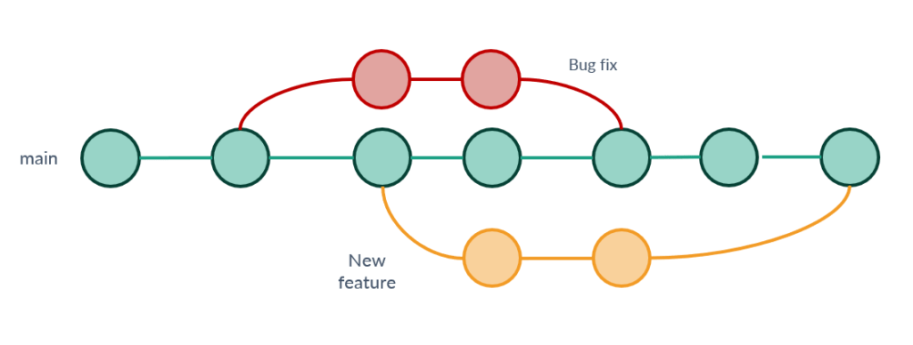

# Introducción del curso

## Objetivos del Curso

*En esta sección, se menciona a grandes razgos el contenido del curso en general, por lo que todos los detalles se expondrán en sus respectivas secciones; no usaremos Git hasta la sección 2.*

Bienvenidos a este curso introductorio de Git, en este curso nos encaminaremos al dominio de una de las herramientas más útiles para todo desarrollador.

Git es un sistema de control de versiones,diseñado para manejar de todo, desde pequeños proyectos independientes hasta grandes y ambiciosos proyectos con rapidez y eficiencia. es una herramienta esencial para desarroladored de cualquier ámbito, permitiendo la colaboración y el seguimiento de cambios en el código de manera organizada.

Tiene una clara Orientación al código; te permite tener a dispocisión las versiones anteriores de cada proyecto en el que trabajes con el fin de tener una "Linea del tiempo" de tu proyecto que te permita ver los cambios que se han realizado a lo largo del tiempo.

Git, de manera automática (a menos que se encuentre un conflicto);

-   Lee los archivos involucrados en el proyecto

-   Determina que cambios hubo en cada archivo actualizado

-   Une bloques de código de un mismo proyecto.

Un conflicto es que varios desarrolladores intentan hacer cambios distintos al mismo contendo, lo que hace que git no sepa cuales cambios guardar.

Existen tecnicas para evitar conflictos, estas se verán dentro del curso.

El objetivo de este curso es que puedas:

-   Administrar y organizar tu equipo de trabajo

-   Plantear y alcanzar metas en conjunto

-   Tener una visión general del repositorio de trabajo

En este curso no se utilizarán gestores con interfáz gráfica, ya que la mayoría de las características más nuevas de git no han sido implementadas en gestores visuales, dado que este tipo de gestores son de uso más básico. Por ello priorizaremos el uso de la consola / terminal del sistema operativo (En el caso de Windows se recomienda utilizar Git Bash) pero, para mayor comodidad, se hará uso de Visual Studio Code.

**Consejo:** Tener una librería (archivo de todos los comandos que veamos), será muy útil para repasar el contenido que vayamos viendo lo que reforzará sus conocimientos adquiridos en el curso.

## ¿Cómo funciona el curso?

El curso se dará en sesiones sincrónicas de aproximadamente 4 horas de duración, a través de zoom, en las que se explican los temas y se presentan ejemplos claros de cada lección para reforzar los conocimientos adquiridos en estas sesiones, contamos con:

-   Tareas practicas

-   Material para ejercicios y prácticas

Para el curso se creará un grupo de WhatsApp en el que se encontrarán los instructores para que puedan expresar sus dudas o compartir material concerniente al curso, sobre todo fuera de las sesiones.

## Instalaciones

Antes de cualquier otra cosa debemos instalar tanto Git, como Visual Studio Code, para ello dejamos enlaces a las páginas oficiales de ambos programas.

Enlaces:

-   [Git](https://git-scm.com/downloads)

-   [Visual Studio Code](https://code.visualstudio.com/download)

Respecto a la documentación, no recommendamos que la lean sin los conocimientos básicos de git, tras haber terminado el curso estarán familiarizados con el mismo lenguaje, lo que les permitirá comprender mejor el contenido de la propia documentación.
