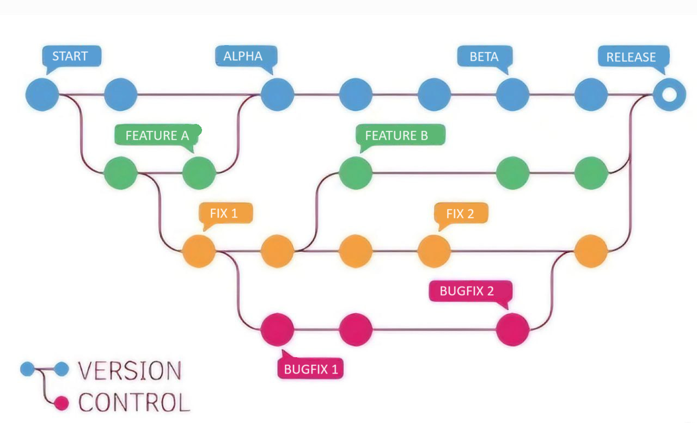
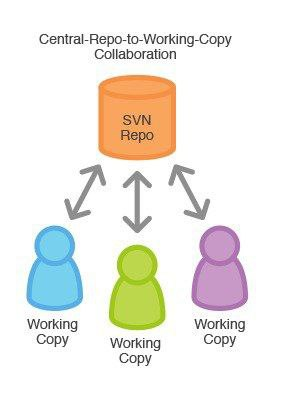
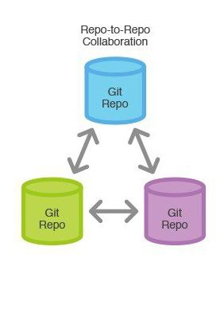

# Fundamentos de Git

A continuación, un par de recomendaciones para el resto del curso:

-   Tomar nota de los comandos que se verán en el curso, así como de que hace y como funciona cada uno, de forma que ustedes mismos entiendan lo que hace un comando y en que casos se ocupa.

-   Constantemente revisar su lista de comandos, esto para que vayan repasando y se familiaricen con los mismos, es recomendable hacerlo antes de cada sesión para tener esos conocimientos frescos.

## Introducción a los fundamentos de Git

Git es un sistema de control de versiones que, a diferencia de otros sistemas de control de versiones, almacena y maneja la información como un conjunto de copias instantáneas de un sistema de archivos miniatura.

La mayoría de las operaciones en Git solo necesitan archivos y recursos locales para funcionar, lo que lo hace muy rápido.

Git tiene tres estados principales en los que se pueden encontrar tus archivos:

- **Confirmado:** significa que los datos están almacenados de manera segura en tu base de datos local. 

- **Modificado:** significa que has modificado el archivo pero todavía no lo has confirmado a tu base de datos. 

- **Preparado:** significa que has marcado un archivo modificado en su versión actual para que vaya en tu próxima confirmación.

Esto nos lleva a las tres secciones principales de un proyecto de Git: El directorio de Git (Git directory), el directorio de trabajo (working directory), y el área de preparación (staging area).

- **El directorio de Git:** Es donde se almacenan los metadatos y la base de datos de objetos para tu proyecto.

- **El directorio de trabajo:** Es una copia de una versión del proyecto. Estos archivos se sacan de la base de datos comprimida en el directorio de Git, y se colocan en disco para que los puedas usar o modificar.

- **El área de preparación:** Es un archivo, generalmente contenido en tu directorio de Git, que almacena información acerca de lo que va a ir en tu próxima confirmación. A veces se le denomina índice (“index”).

Git está diseñado para gestionar proyectos de software y otros tipos de documentos de manera eficiente y colaborativa. Aquí están algunos conceptos fundamentales:

-   **Repositorio:** Es un espacio donde Git almacena todos los archivos y carpetas que forman parte de tu proyecto.

-   **Clonar:** Es hacer una copia exacta de un repositorio remoto en tu máquina local.

-   **Status:** Muestra el estado actual de tu repositorio de Git, incluyendo cambios sin confirmar y archivos no rastreados.

-   **Commit:** Es un registro de cambios en el repositorio. Cada commit tiene un mensaje que describe los cambios realizados.

-   **Branch (Rama):** Es una versión paralela del código principal. Se utilizan para desarrollar funcionalidades nuevas sin afectar el código principal hasta que estén listas.

-   **Merge (Fusionar):** Es el proceso de combinar cambios de una rama a otra. Por ejemplo, fusionar una rama de funcionalidad en la rama principal (como `main` o `master`).

-   **Push (Subir)** y **Pull (Bajar):** `Push` se refiere a enviar cambios locales al repositorio remoto, mientras que `Pull` es obtener cambios del repositorio remoto a tu repositorio local.


## Importancia de Git

**¿Porqué es importante saber Git o cualquier otro sistema de control de versiones?**

Los sistemas de control de versiones (SCV), como lo es Git, son fundamentales en el desarrollo de software por varias razones clave:

-   **Gestión de Historial:** Permiten mantener un registro detallado de todos los cambios realizados en el código y documentos del proyecto. Cada modificación se documenta con un mensaje descriptivo, lo que facilita la comprensión de la evolución del proyecto.

-   **Colaboración Eficiente:** Facilitan el trabajo en equipo al permitir que varios desarrolladores trabajen simultáneamente en diferentes aspectos del proyecto. Las ramas (branches) permiten trabajar en nuevas funcionalidades sin interferir con el código principal.

-   **Reversión y Recuperación:** Ofrecen la capacidad de revertir cambios no deseados o recuperar versiones anteriores del código en caso de errores o problemas inesperados.

-   **Experimentación Segura:** Las ramas permiten probar nuevas ideas de forma segura antes de integrarlas en el código principal, lo que ayuda a mantener la estabilidad del proyecto.

-   **Seguimiento de Responsabilidades:** Asignan responsabilidades claras al registrar quién realizó cada cambio y cuándo, lo que facilita la revisión y la resolución de problemas.

*Es como en un videojuego donde tienes puntos de control, en el caso de Git serían los commits, a los que puedes volver si te encuentras en un problema y debes andar por otro camino o seguir una estrategia diferente.*



En resumen, los SCV son esenciales para mantener la integridad, colaboración y evolución ordenada de los proyectos de software, mejorando la eficiencia y reduciendo el riesgo de errores en el desarrollo.

Existen distintos modelos de SCV, a continuación explicaremos 2 de los más implementados:

-   **Repositorio Central**

    

    Es un modelo de control de versiones donde existe un único servidor central que contiene la versión principal del proyecto. Los desarrolladores envían sus cambios directamente a este servidor central.

    **Características:**

    -   **Centralizado:** Todos los desarrolladores envían y reciben cambios desde el mismo lugar.

    -   **Dependencia del servidor:** Requiere acceso constante al servidor central para realizar operaciones clave como commits y actualizaciones.

    -   **Historial único:** El historial completo del proyecto reside en el servidor central.

-   **Repositorio Distribuido**

    

    En este modelo cada desarrollador tiene una copia completa del repositorio, incluyendo historial y ramas, en su máquina local. Los cambios se intercambian directamente entre repositorios locales o a través de uno central opcional.

    **Características:**

    -   **Descentralizado:** Cada desarrollador tiene su propio repositorio completo, lo que permite trabajar sin conexión a internet y facilita la colaboración.

    -   **Flexibilidad:** Los cambios pueden ser compartidos entre repositorios locales o a través de repositorios remotos.

    -   **Ramas y experimentación:** Permite a los desarrolladores trabajar en ramas independientes y experimentar sin afectar el repositorio principal hasta que estén listos.

La diferencia clave radica en la arquitectura y la forma en que se gestionan y comparten los cambios. Los repositorios centrales son más tradicionales y dependen de un servidor centralizado, mientras que los distribuidos ofrecen mayor flexibilidad, autonomía y capacidad de trabajo offline.

Git trabaja con el sistema de repositorio distribuido lo que permite que todo el equipo trabaje libremente sin depender de que el servidor central permanezca en condiciones de trabajo.


## Configuración inicial de Git

Para comenzar vamos a configurar nuestro nombre de usuario, así como nuestro correo electrónico, estos van a servir para identificarnos y, más adelante, conectarnos con Github.

```{bash eval=F}
git config --global user.name "[Nombre de usuario]"
```

```{bash eval=F}
git config --global user.email "[Direccion de correo]"
```

El correo no necesariamnete debe estar registrado en Github, sin embargo, para trabajar con esta plataforma es recomendable usar el correo con el que te registraste o vas a registrar en Github, ya que tanto el nombre como el correo sirven para identificar al usuario.

Al iniciar un repositorio, Git crea una rama principal que generalmente es llamada `master` o `main`, Por diversas razones ultimamente  esta segunda opción se  ha vuelto la prferencia, por lo que vamos a establecer `main` como nombre por defecto de la rama principal:

```{bash eval=F}
git config --global init.defaultBranch main
```

Con este comando se establece `main` como nombre por defecto de la rama principal para cualquier nuevo repositorio.

Si prefieres cambiar el nombre de la rama principal, o cualquier otra, puedes usar:

```{bash eval=F}
git branch -m [actual] [nuevo]
```
  
Cambia el nombre `[actual]` de la rama por el `[nuevo]` en el repositorio actual sin alterar la configuración.


Para visualizar las configuraciones que tenemos en git, podemos utilizar el comando

```{bash eval=F}
git config --global -e
```

```{bash eval=F}
[user]
  name = Nombre de usuario
  email = Direccion de correo
[init]
  defaultBranch = main
```


Este comando abre el archivo de configuración global de Git en el editor de texto predeterminado para que puedas editarlo.

## Primeros comandos de Git

Para empezar vamos a abrir la terminal, en caso de Windows Git Bash, para presentar los primeros comandos.

```{bash eval=F}
git --version
```

```{bash eval=F}
git version 2.34.1
```
Muestra la versión instalada de Git en tu sistema. En este caso contamos con la versión `2.34.1` de Git.

```{bash eval=F}
git --help
```

```{bash eval=F}
usage: git [--version] [--help] [-C <path>] [-c <name>=<value>]
           [--exec-path[=<path>]] [--html-path] [--man-path] [--info-path]
           [-p | --paginate | -P | --no-pager] [--no-replace-objects] [--bare]
           [--git-dir=<path>] [--work-tree=<path>] [--namespace=<name>]
           [--super-prefix=<path>] [--config-env=<name>=<envvar>]
           <command> [<args>]

These are common Git commands used in various situations:

start a working area (see also: git help tutorial)
   clone     Clone a repository into a new directory
   init      Create an empty Git repository or reinitialize an existing one

work on the current change (see also: git help everyday)
   add       Add file contents to the index
   mv        Move or rename a file, a directory, or a symlink
   restore   Restore working tree files
   rm        Remove files from the working tree and from the index

examine the history and state (see also: git help revisions)
   bisect    Use binary search to find the commit that introduced a bug
   diff      Show changes between commits, commit and working tree, etc
   grep      Print lines matching a pattern
   log       Show commit logs
   show      Show various types of objects
   status    Show the working tree status

grow, mark and tweak your common history
   branch    List, create, or delete branches
   commit    Record changes to the repository
   merge     Join two or more development histories together
   rebase    Reapply commits on top of another base tip
   reset     Reset current HEAD to the specified state
   switch    Switch branches
   tag       Create, list, delete or verify a tag object signed with GPG

collaborate (see also: git help workflows)
   fetch     Download objects and refs from another repository
   pull      Fetch from and integrate with another repository or a local branch
   push      Update remote refs along with associated objects

'git help -a' and 'git help -g' list available subcommands and some
concept guides. See 'git help <command>' or 'git help <concept>'
to read about a specific subcommand or concept.
<!-- See 'git help git' for an overview of the system. -->
```

Muestra una lista de comandos disponibles en Git junto con una breve descripción de cada uno y cómo usarlos.

```{bash eval=F}
git --help [nombre del comando]
```

Muestra la documentación detallada y las opciones disponibles para el comando especificado en Git.

## Primer Repositorio [Ejercicio]

Con el material [Material]() y en compañía de los instructores, van a crear su primer repositorio. 

En este ejercicio se van a presentar los siguientes comandos: 

```{bash eval=F}
git init
```

```{bash eval=F}
Inicializado repositorio Git vacío en /[ubicación del directorio]/.git/
```

Este comando inicializa un nuevo repositorio de Git en el directorio actual `[Ubicación del directorio]`, creando un subdirectorio `.git` con todos los archivos necesarios para el control de versiones.

```{bash eval=F}
git status
```

```{bash eval=F}
En la rama main

No hay commits todavía

no hay nada para confirmar (crea/copia archivos y usa "git add" para hacerles seguimiento)
```

El comando muestra el estado actual del repositorio, incluyendo los cambios en el área de preparación y los archivos modificados que no están preparados para el commit.

```{bash eval=F}
git add [Nombre del archivo/directorio]
```

Añade el `archivo/directorio` al área de preparación para ser incliudo en el próximo commit, en caso de ser un directorio se agregan tolos los archivos y subdirectorios que contiene.

```{bash eval=F}
git add .
```

Agrega todos los archivos nuevos y modificados del directorio actual al área de preparación para el próximo commit.

```{bash eval=F}
git reset [archivo/directorio]
```

Deshace los cambios en el `archivo/directorio` especificado, retirándolo del área de preparación sin modificar el directorio de trabajo.

```{bash eval=F}
git commit -m "nombre del commit"
```

```{bash eval=F}
[main (commit-raíz) 3648c0e] nombre del commit
 6 files changed, 604 insertions(+)
 create mode 100644 .DS_Store
 create mode 100644 css/.DS_Store
 create mode 100755 css/bootstrap.min.css
 create mode 100644 css/bootstrap/.DS_Store
 create mode 100644 css/bootstrap/_media.css
 create mode 100644 css/bootstrap/mixins/.DS_Store
```


Realiza un commit con un mensaje descriptivo especificado en `"nombre del commit"`, guardando los cambios realizados en el repositorio de Git.

Hasta esta parte del ejercicio creaste tu primer repositorio, conociste al área de preparación e hiciste tu primer commit.
Quizá ahora tengas una pregunta en mente.

__¿Para qué me sirve estar haciendo commit frecuetemente?__.  
Supongamos que por un fallo se corrompieron los archivos en los que estabas trabajando, o que por error borraste algo que no debías; esta clase de sucesos ocurren con bastante frecuencia pero, con ayuda de Git, podrás recuperar tu información.

```{bash eval=F}
git checkout -- .
```

El comando `git checkout` tiene muchas funcionalidades, pero en particular `git checkout -- .` restaura todos los archivos en el directorio de trabajo a su estado más reciente en el repositorio (último commit), descartando los cambios no confirmados, permitiendo recuperar la información delo último commit realizado, pero esto __sólo con los archivos a los que Git les da seguimiento__, por lo que es una buena páctica hacer commit con cierta regularidad.

```{bash eval=F}
git log
```

```{bash eval=F}
commit e4d9d8e7b9367137765f42870a06e29d295a7434 (HEAD -> main)
Author: [Nombre de usuario] <[Direccion de correo]>
Date:   Mon Jul 8 21:55:45 2024 -0600

    se agrgan archivos SCSS

commit b71cd6d5306d5c19dc6f53bef8f1ff3f62da0bf2
Author: [Nombre de usuario] <[Direccion de correo]>
Date:   Mon Jul 8 21:55:07 2024 -0600

    se agregan archivos JS

commit 8daaec9718c9e4239162092251660cbc9b3e7ed8
Author: [Nombre de usuario] <[Direccion de correo]>
Date:   Mon Jul 8 21:54:41 2024 -0600

    se agrega uploads

commit ff7c40ac6a9d942e818cf2bd3996b193f8b07101
Author: [Nombre de usuario] <[Direccion de correo]>
Date:   Mon Jul 8 21:54:17 2024 -0600

    se agregan fuentes e imagenes
```

Muestra el historial de commits del repositorio, incluyendo mensajes, autores y fechas, la clave alfanumérica que aparece al principio de cada commit es el hash con el que Git regitra ese commit, cada clave es distinta y le corresponde una única instantanea (commit).
Este comando muestra mucha información que realmente entorpece la visualización, pero hay maneras de mejorar la forma en que se presenta esta información.

```{bash eval=F}
git log --oneline
```

```{bash eval=F}
e4d9d8e (HEAD -> main) se agrgan archivos SCSS
b71cd6d se agregan archivos JS
8daaec9 se agrega uploads
ff7c40a se agregan fuentes e imagenes
```

Muestra una forma reducida del hash de cada commit seguido de su mensaje de identificación.  
Cabe aclarar que la palabra `HEAD` marca al último commit realizado y que `(HEAD -> main)` indica que dicho commit se realizó en la rama `main`.

## Distintas maneras de agregar elementos al Stage

Ya sabemos que con `git add` podemos agregar uno por uno los elementos que deseamos al Stage (área de preparación), y que con `git add .` podemos agregar todos los archivos disponibles, pero imagina que modificaste muchos archivos, pero no quieres agregalos todos y hacerlo de uno en uno sería muy tardado.  
Puedes agregar archivos con el mismo formata ubicados en el mismo directorio utilizando:

```{bash eval=F}
git add *.[formato]
```

Agrega al Stage todos los archivos `.[formato]` que se encuentren en el directorio actual, pero no hará nada con los archivos que se encuentren en un subdirectorio.

```{bash eval=F}
git add [subdirectorio]/*.[formato]
```

Este comando agrega los archivos `.[formato]` dentro de `[subdirectorio]/` al Stage.

```{bash eval=F}
git add [subdirectorio]/
```
Agrega todos los archivos modificados del `[subdirectorio]`.

__Nota:__ Git de manera automática ignora los directorios vacíos por lo que, si no tienes cuidado, puede ignorar un fichero importante y llegar a romper tu proyecto, para evitarlo se suele agregar un archivo llamado `.gitkeep`  a las carpetas vacías un archivo especial para que git reconozca que deve hacerles seguimiento.

De esta manera puedes organizar más facilmente los elementos modificados.

## Repaso

Ahora un breve repaso de los comandos que hemos visto hasta ahora.

```{bash eval=F} 
git config --global user.name "[Nombre de usuario]"
```
  
Configura el nombre de usuario global para todos los repositorios de Git en tu sistema.
  
```{bash eval=F} 
git config --global user.email "[Direccion de correo]"
```
  
Configura el correo electrónico global para todos los repositorios de Git en tu sistema.
  
```{bash eval=F}
git config --global init.defaultBranch main
```

Con este comando se establece `main` como nombre por defecto de la rama principal para cualquier nuevo repositorio.

```{bash eval=F}
git branch -m [actual] [nuevo]
```

Cambia el nombre `[actual]` de la rama por el `[nuevo]`.
  
```{bash eval=F} 
git config --global -e
```
  
Abre el archivo de configuración global de Git en tu editor de texto predeterminado para que puedas editarlo.
  
```{bash eval=F} 
git --version
```
  
Muestra la versión instalada de Git en tu sistema
  
```{bash eval=F} 
git --help
```
  
Muestra una lista de comandos disponibles en Git junto con una breve descripción de cada uno y cómo usarlos.
  
```{bash eval=F} 
git --help [nombre del comando]
```
  
Muestra la documentación detallada y las opciones disponibles para el comando especificado en Git.
  
```{bash eval=F} 
git init
```
  
Este comando inicializa un nuevo repositorio de Git en el directorio actual.
  
```{bash eval=F} 
git status
```
  
Muestra el estado actual del repositorio, incluyendo los cambios en el área de preparación y los archivos modificados que no están preparados para el commit.
  
```{bash eval=F} 
git add
```
  
Añade archivos al área de preparación para ser incluidos en el próximo commit.
  
```{bash eval=F} 
git add .
```
  
Agrega todos los archivos nuevos y modificados del directorio actual al área de preparación para el próximo commit.
  
```{bash eval=F} 
git reset [archivo]
```
  
Deshace los cambios en el archivo especificado, retirándolo del área de preparación sin modificar el directorio de trabajo.
  
```{bash eval=F} 
git commit -m "nombre del commit"
```
  
Realiza un commit con un mensaje descriptivo especificado, guardando los cambios realizados en el repositorio de Git.
  
```{bash eval=F} 
git checkout -- .
```
  
Restaura todos los archivos en el directorio de trabajo a su estado más reciente en el repositorio (último commit), descartando los cambios no confirmados.
  
```{bash eval=F}
git log
```

Muestra el historial de commits del repositorio, incluyendo mensajes, autores y fechas.

```{bash eval=F}
git add *.[formato]
```

Agrega al Stage todos los archivos `.[formato]` que se encuentren en el directorio actual.

```{bash eval=F}
git add [subdirectorio]/*.[formato]
```

Este comando agrega los archivos `.[formato]` dentro de `[subdirectorio]/` al Stage.

```{bash eval=F}
git add [subdirectorio]/
```
Agrega todos los archivos modificados del `[subdirectorio]`.

## Alias

Ya conocen los comandos más básicos de Git y seguro han notado que muchos muestran información que generalmente no necesitamos, la gran mayoría de comandos en Git cuentan con etiquetas que permiten mostrar la información de manera distinta a como se hace normalmente pero, como se imaginarán, mejorar la visualización de la información hace que los comandos se extiendan mucho; por ello ahora aprenderán a crear sus propios alias.  
Un alias de Git es un atajo personalizado que se configura para simplificar y acortar comandos de Git frecuentemente usados.

Para crear tu propio alias utiliza:

```{bash eval=F}
git config --global alias.[alias] "[Comando]"
```

Establece un alias de manera que `git [alias]` hará lo mismo que `git "[comando]"`

Así pueden crear tus propios alias para facilitarse el trabajo.

Un ejemplo muy útil sería:

```{bash eval=F}
git config --global alias.s "status -s -b"
```

Veamos el cambio, la salida de `status`

```{bash eval=F}
git status
```

```{bash eval=F}
En la rama main
Cambios a ser confirmados:
  (usa "git restore --staged <archivo>..." para sacar del área de stage)
	nuevos archivos: java/resourse.java

Archivos sin seguimiento:
  (usa "git add <archivo>..." para incluirlo a lo que será confirmado)
	java/focus.java
	java/init.java
```

La salida de `s`

```{bash eval=F}
git s
```

```{bash eval=F}
## main
A  java/resourse.java
?? java/focus.java
?? java/init.java
```

Como pueden ver, el uso de alias es muy útil, sobre todo con comandos que se usan repetidamente.

