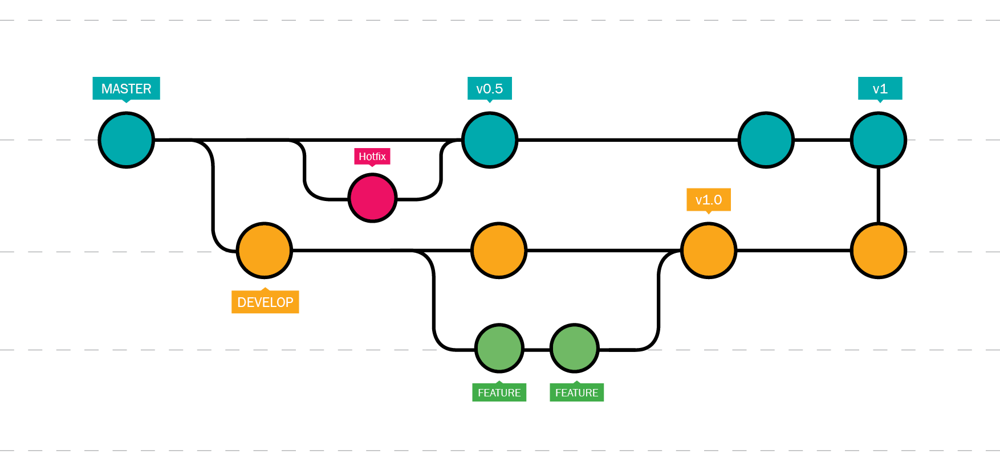

# Ramas

En esta seccion aprenderemos a emplear las Ramas: crearlas, movernos entre ellas, unir ramas y otras funcionalidades que ofrece Git. Primero hay que saber lo que es una rama.

**Rama (Branch)**: Es una versión paralela del proyecto, permitie trabajar en el desarrollo o la implementación de nuevas características sin afectar la rama principal.



Podemos ver a las ramas como lineas donde la rama `main/master` es la linea central, mientras que las ramas que se desprenden de esta avanzan de forma paralela a la principal, lo que permite tomar caminos distintos sin alterar la rama principal.  

::: {.infobox}

**La Rama `main`**

Es como la **sagrada línea del tiempo** del multiverso. Es la versión principal y estable de la historia, donde los eventos más importantes suceden. 

* **Ejemplo:** 

En el MCU, la sagrada línea del tiempo incluye eventos clave como la creación de los Vengadores, la batalla contra Thanos, y el sacrificio de Tony Stark.

:::

Crear una rama en Git significa generar una línea paralela de desarrollo en el repositorio. Esto te permite trabajar en cambios o características nuevas de forma aislada, sin afectar la rama principal (main o master)

::: {.infobox}


**Crear una Rama**

Es como generar una **realidad alternativa** dentro del multiverso. Esta nueva línea puede desarrollarse de manera independiente sin afectar la línea principal hasta que decidas unirlas.

* **Ejemplo:** 

Cuando Loki toma el Tesseract en *Avengers: Endgame*, crea una nueva línea temporal. Esa nueva línea no afecta la sagrada hasta que interactúe directamente con ella.

:::


Moverse entre ramas en Git significa cambiar el contexto de trabajo para apuntar a una rama específica. Esto actualiza el estado del directorio de trabajo al contenido de la rama seleccionada, incluyendo los archivos y la referencia de commits.

::: {.infobox}

**Moverse Entre Ramas**
Es como **cambiar de una realidad a otra**. Puedes viajar entre estas realidades alternativas para trabajar en diferentes historias sin perder el contexto de cada una.

* **Ejemplo:** 

Doctor Strange usando el Darkhold para explorar diferentes universos en *Doctor Strange in the Multiverse of Madness*. Cambia entre realidades para lograr un objetivo específico.

:::


Como parte del uso de las ramas, contamos con la posibiliad de tomar los cambios realizados en una rama y llevarlos a la rama principal, por ejemplo en caso de haber terminado la implmentación de una nueva característica, podemos llevar todo ese trabajo a la rama `main/master` para incluir dicha implementación, esto se a través del `merge`.

**Merge**: Es el proceso de combinar cambios de diferentes ramas en una sola rama.


::: {.infobox}

**Unir Ramas (Merge)**
Es como **fusionar realidades alternativas con la sagrada línea del tiempo**. Al hacerlo, introduces los cambios (o eventos) de la línea alternativa en la principal.

* **Ejemplo:**

En *Spider-Man: No Way Home*, las líneas temporales de los otros Spider-Man (Tobey Maguire y Andrew Garfield) se unen con la línea de Tom Holland para enfrentar un desafío común.

:::

Este proceso se puede realizar de distintas maneras:

* **Fast-forward**: Un fast-forward en Git es una fusión en la que la rama de destino avanza directamente al nuevo commit sin crear un commit de fusión.


::: {.infobox}

**Fast-Forward**

El fast-forward ocurre cuando una rama no tiene cambios adicionales y se puede mover directamente hacia la rama principal. Es como **seguir la línea sagrada sin crear ramas alternas complicadas**.  

* **Ejemplo:**

En *Loki*, si una variante sigue exactamente los pasos de la línea sagrada, no necesita intervención de la TVA para mantenerse alineada.

:::


* **Unión automática (Automatic merge)**: Una unión automática en Git es cuando Git fusiona automáticamente cambios de diferentes ramas sin conflictos manuales.


::: {.infobox}

**Automatic Merge**

Un merge automático ocurre cuando las diferencias entre ramas se combinan sin conflicto.  

* **Ejemplo:**

En *Infinity War*, los Guardianes de la Galaxia y los Vengadores unen fuerzas sin problemas iniciales para detener a Thanos.

:::


* **Unión manual (Manual merge)**: Una unión manual en Git ocurre cuando se requieren resoluciones de conflictos por parte del usuario durante el proceso de fusión entre ramas.


::: {.infobox}

**Manual Merge**

Es necesario cuando hay conflictos que deben resolverse antes de completar la fusión.  

* **Ejemplo:**

En *Civil War*, los héroes intentan trabajar juntos, pero las diferencias entre Tony Stark y Steve Rogers provocan un conflicto que necesita solución antes de seguir adelante.

:::

Es evidente que las el uso de las ramas es muy útil en el desarrollo de cualquier proyecto, pues nos permite hacer nuevas implementaciones y/o cambios en el código sin afectar la rama principal del repositorio.


## Merge: Fast-forward

Seguiremos trabajando con el material `material-marvel`asi que nos colocaremos desde la terminal en la ubicacion del material y seguiremos las siguientes instrucciones:

1. Para listar las ramas que tenemos en el repositorio emplearemos:

```{bash eval=F}
git branch
```
```{bash eval=F}
* main
```

2. Supongamos ahora que hay héroes de Tierra-99999 que se quieren unir a nuestra agrupación principal de héroes por lo que haremos una nueva rama del registro para incorporarlos mientras se evaluan sus aptitudes para integrarse al equipo:

```{bash eval=F}
git branch tierra-99999
```

Si volvemos a listar las ramas, encontraremos esta nueva rama que acabamos de crear:

```{bash eval=F}
git branch
```
```{bash eval=F}
* main
  tierra-99999
```

Aquí podemos notar que Git nos indica la rama en la que nos encontramos a través de un asterisco `*` que precede al nombre de la rama sobre la que nos ubicamos, en este caso la rama `main`

Como el registo es para los héroes de tierra-99999, vamos a cambiar a la rama que acabamos de crear:

```{bash eval=F}
git checkout tierra-99999
```
```{bash eval=F}
Cambiado a rama 'tierra-99999'
```

Ahora, si listamos los cambios de nuestro repositorio, notaremos algo interesante:

```{bash eval=F}
git lg
```
```{bash eval=F}
* c20b80d - (hace 4 minutos) .gitignore actualizado (extension .log) - [Nombre de usuario] (HEAD -> tierra-99999, main)
* 2ed8cf4 - (hace 5 minutos) .gitignore agregado - [Nombre de usuario]
* c9ffd15 - (hace 10 minutos) sin saignaciones para Spider-Man - [Nombre de usuario]
* e31eae6 - (hace 14 minutos) misiones de Spider-Man completadas - [Nombre de usuario]
* 0059540 - (hace 15 minutos) contactos.md eliminado - [Nombre de usuario]
* 2d05f6e - (hace 18 minutos) contactos.md renombrado - [Nombre de usuario]
* 1c7fe32 - (hace 19 minutos) contactos de emergencia agregados - [Nombre de usuario]
* 8727c32 - (hace 26 minutos) se unen Doctor Strange y Daredevil - [Nombre de usuario]
* a2427e8 - (hace 43 minutos) misiones/ agregado -> misiones de los heroes: iron man, thor, hulk, black widow y spider man. - [Nombre de usuario]
* 43b3a69 - (hace 44 minutos) debilidades.md agregado - [Nombre de usuario]
* c691147 - (hace 44 minutos) origenes.md agregado - [Nombre de usuario]
* ec89c02 - (hace 45 minutos) descripciones.md agregado - [Nombre de usuario]
* ac02fe0 - (hace 45 minutos) README.md agregado - [Nombre de usuario]%
```

Además de aparecer los nuevos commits que realizamos, podemos notar que al final de la primer línea, tenemos `(HEAD -> tierra-99999, main)`, lo que nos indica que el último commit registrado por las ramas `main` y `tierra-99999` es el mismo, es decir, ambas estan en el mismo punto del repositorio, tambien podemos notar que no ha cambiado nada en los archivos o directorios.

3. Procediendo a hacer modificaciones en el repositorio.

Vamos a crear el registro de los siguientes dos heroes: `Captain Marvel` y `Doctor Doom`, por lo que modificaremos los archivos `Readme.md`, `descripciones.md`, `origenes.md`, `debilidades.md` y les asignaremos misiones a cada uno.

Para el archivo `descripciones.md` agregamos:

```{bash eval=F}

## Captain Marvel

- **Nombre real:** Carol Danvers
- **Descripción:** Proviene de una dimensión alterna donde los Kree y los Skrulls se aliaron para derrotar a los humanos. Su poder proviene de una combinación de ADN humano y Kree.

## Doctor Doom

- **Nombre real:** Victor Von Doom
- **Descripción:** Un genio y hechicero de la dimensión alterna que combina ciencia avanzada con magia. A pesar de su ego y su búsqueda de poder, también lucha por la paz a su manera.

```

Al archivo `origenes.md` se le agrega:

```{bash eval=F}

## Captain Marvel

- Un accidente relacionado con una tecnología alienígena la expuso a la energía de un artefacto Kree, lo que alteró su biología.

## Doctor Doom

- Después de perder a su madre en un ritual mágico que salió mal, tomó el control de su nación para asegurar la paz bajo su dominio.

```

Para el archivo `debilidades.md` añadimos:

```{bash eval=F}

## Captain Marvel

- Vulnerabilidad a la magia 
- Su conexión con el poder de la Fuerza Kree puede ser inestable.

## Doctor Doom

- Vulnerable a la magia y al control mental.
- Su obsesión con el control absoluto lo hace susceptible a tomar decisiones que pueden llevar a su caída.

```

Para las misiones, generamos un nuevo registro para cada uno.

Las misiones agregadas a `misiones/captain_marvel_t-99999.md`:

```{bash eval=F}
# Misiones de Captain Marvel

1. **Defender la estación espacial de una invasión Skrull**
   
   - Descripción: Detener el ataque de los Skrulls y proteger la estación espacial en el borde de la galaxia.
   - Prioridad: Alta
   - Fecha límite: 2025-02-01

2. **Investigar una anomalía en el espacio-tiempo**
   
   - Descripción: Analizar una distorsión en el espacio-tiempo que está afectando las rutas de navegación interdimensional.
   - Prioridad: Media
   - Fecha límite: 2025-03-01

3. **Colaborar con otras dimensiones para evitar el colapso de los multiversos**
   
   - Descripción: Unirse a héroes de otras realidades para prevenir una crisis que podría destruir las fronteras entre los universos.
   - Prioridad: Alta
   - Fecha límite: 2025-03-15

```

Las misiones agregadas a `misiones/doctor_doom_t-99999.md`:

```{bash eval=F}
# Misiones de Doctor Doom

1. **Conquistar una ciudad en una dimensión paralela**
   
   - Descripción: Invadir y tomar el control de una ciudad en una dimensión alternativa para expandir su imperio.
   - Prioridad: Alta
   - Fecha límite: 2025-02-10

2. **Investigar una antigua reliquia mágica**
   
   - Descripción: Desentrañar los secretos de un artefacto místico para incrementar sus habilidades mágicas y científicas.
   - Prioridad: Alta
   - Fecha límite: 2025-02-20

3. **Frenar un cataclismo dimensional causado por un enemigo desconocido**
   
   - Descripción: Detener el colapso de múltiples realidades que amenaza con destruir el multiverso.
   - Prioridad: Alta
   - Fecha límite: 2025-03-01

```

Verificando el estado del repositorio:

```{bash eval=F}
git s
```

```{bash eval=F}
## tierra-99999
 M debilidades.md
 M descripciones.md
 M origenes.md
?? misiones/captain_marvel_t-99999.md
?? misiones/doctor_doom_t-99999.md
```


4. Agregamos todo al Stage y hacemos un commit

```{bash eval=F}
git add .
```
```{bash eval=F}
git commit -m "se unen Captain marvel y Doctor Doom de Tierra-99999"
```
```{bash eval=F}
[tierra-99999 6976c5a] se unen Captain marvel y Doctor Doom de Tierra-99999
 5 files changed, 66 insertions(+)
 create mode 100644 misiones/captain_marvel_t-99999.md
 create mode 100644 misiones/doctor_doom_t-99999.md
```

5. Listamos los registros:

```{bash eval=F}
git lg
```
```{bash eval=F}
* 6976c5a - (hace 26 segundos) se unen Captain marvel y Doctor Doom de Tierra-99999 - [Nombre de usuario] (HEAD -> tierra-99999)
* c20b80d - (hace 8 minutos) .gitignore actualizado (extension .log) - [Nombre de usuario] (main)
* 2ed8cf4 - (hace 10 minutos) .gitignore agregado - [Nombre de usuario]
* c9ffd15 - (hace 14 minutos) sin saignaciones para Spider-Man - [Nombre de usuario]
* e31eae6 - (hace 19 minutos) misiones de Spider-Man completadas - [Nombre de usuario]
* 0059540 - (hace 19 minutos) contactos.md eliminado - [Nombre de usuario]
* 2d05f6e - (hace 22 minutos) contactos.md renombrado - [Nombre de usuario]
* 1c7fe32 - (hace 23 minutos) contactos de emergencia agregados - [Nombre de usuario]
* 8727c32 - (hace 30 minutos) se unen Doctor Strange y Daredevil - [Nombre de usuario]
* a2427e8 - (hace 48 minutos) misiones/ agregado -> misiones de los heroes: iron man, thor, hulk, black widow y spider man. - [Nombre de usuario]
* 43b3a69 - (hace 48 minutos) debilidades.md agregado - [Nombre de usuario]
* c691147 - (hace 49 minutos) origenes.md agregado - [Nombre de usuario]
* ec89c02 - (hace 49 minutos) descripciones.md agregado - [Nombre de usuario]
* ac02fe0 - (hace 50 minutos) README.md agregado - [Nombre de usuario]%        
```

Podemos notar que la rama `main` se queda un commit por debajo de `tierra-99999`, que ahora es el `HEAD`, esto porque los cambios que registramos solo afectan a la rama actual, `tierra-99999`.

6. Al poco tiempo se une también `Scarlet Which`, por lo que hacemos su registro.

Para el archivo `descripciones.md` agregamos:

```{bash eval=F}

## Scarlet Witch

- **Nombre real:** Wanda Maximoff
- **Descripción:** Una poderosa hechicera que perfeccionó su control del caos y del multiverso.

```

Al archivo `origenes.md` se le agrega:

```{bash eval=F}

## Scarlet Witch

- Descubrió el Grimorio Oscuro a una edad temprana, lo que la llevó a comprender y controlar la magia del caos de manera más efectiva.

```

Para el archivo `debilidades.md` añadimos:

```{bash eval=F}

## Scarlet Witch

- Vulnerable a ataques psíquicos de alta intensidad y al desgaste emocionalmente
- El uso prolongado del Grimorio Oscuro puede corroer su mente.

```

Para las misiones, generamos un nuevo registro para cada uno.

Las misiones agregadas a `misiones/scarlet_witch_t-99999.md`:

```{bash eval=F}
# Misiones de Scarlet Witch

1. **Reparar los portales dimensionales dañados**

   - Descripción: Utilizar su magia para estabilizar los portales que conectan Tierra-99999 con otras dimensiones.
   - Prioridad: Alta
   - Fecha límite: 2025-02-15

2. **Neutralizar una convergencia mágica inestable**

   - Descripción: Identificar y detener un evento en el que múltiples líneas temporales intentan fusionarse.
   - Prioridad: Alta
   - Fecha límite: 2025-03-05

3. **Recuperar el Grimorio Perdido**

   - Descripción: Localizar un grimorio antiguo que contiene conocimientos esenciales para prevenir un apocalipsis multiversal.
   - Prioridad: Media
   - Fecha límite: 2025-03-20

```

Para este punto los héroes de `tierra-99999` muestran ser buenos elementos por lo que se les agrega al registro principal, en el archivo `README.md`, al que se le añade:

```{bash eval=F}
  - [captain marvel (T-99999)](/misiones/captain_marvel_t-99999.md)
  - [doctor doom (T-99999)](/misiones/doctor_doom_t-99999.md)
  - [scarlet witch (T-99999)](/misiones/scarlet_witch_t-99999.md)
```

Verificando el estado del repositorio:

```{bash eval=F}
git s
```

```{bash eval=F}
## tierra-99999
 M README.md
 M debilidades.md
 M descripciones.md
 M origenes.md
?? misiones/scarlet_witch_t-99999.md
```

7. Agregamos al Stage y hacemos un commit

```{bash eval=F}
git add .
```
```{bash eval=F}
git commit -m "se une Scarlet Witch de Tierra-99999; se termina el registro de T-99999"
```
```{bash eval=F}
[tierra-99999 f5907d1] se une Scarlet Witch de Tierra-99999; se termina el registro de T-99999
 5 files changed, 36 insertions(+)
 create mode 100644 misiones/scarlet_witch_t-99999.md
```

8. Listamos los registros:

```{bash eval=F}
git lg
```
```{bash eval=F}
* f5907d1 - (hace 18 segundos) se une Scarlet Witch de Tierra-99999; se termina el registro de T-99999 - [Nombre de usuario] (HEAD -> tierra-99999)
* 6976c5a - (hace 5 minutos) se unen Captain marvel y Doctor Doom de Tierra-99999 - [Nombre de usuario]
* c20b80d - (hace 12 minutos) .gitignore actualizado (extension .log) - [Nombre de usuario] (main)
* 2ed8cf4 - (hace 14 minutos) .gitignore agregado - [Nombre de usuario]
* c9ffd15 - (hace 18 minutos) sin saignaciones para Spider-Man - [Nombre de usuario]
* e31eae6 - (hace 23 minutos) misiones de Spider-Man completadas - [Nombre de usuario]
* 0059540 - (hace 23 minutos) contactos.md eliminado - [Nombre de usuario]
* 2d05f6e - (hace 26 minutos) contactos.md renombrado - [Nombre de usuario]
* 1c7fe32 - (hace 27 minutos) contactos de emergencia agregados - [Nombre de usuario]
* 8727c32 - (hace 34 minutos) se unen Doctor Strange y Daredevil - [Nombre de usuario]
* a2427e8 - (hace 52 minutos) misiones/ agregado -> misiones de los heroes: iron man, thor, hulk, black widow y spider man. - [Nombre de usuario]
* 43b3a69 - (hace 52 minutos) debilidades.md agregado - [Nombre de usuario]
* c691147 - (hace 53 minutos) origenes.md agregado - [Nombre de usuario]
* ec89c02 - (hace 53 minutos) descripciones.md agregado - [Nombre de usuario]
* ac02fe0 - (hace 54 minutos) README.md agregado - [Nombre de usuario]%   
```

Ahora tenemos la rama `tierra-99999` dos commits por delante de `main`.

Lo que haremos a continuación es llevar estos cambios a la rama `main`.

9. Nos colocamos en la rama a donde llevaremos los cambios, en este caso `main`:

```{bash eval=F}
git checkout main
```
```{bash eval=F}
Cambiado a rama 'main'
```

Notemos que los archivos y carpetas que creamos en la rama `tierra-99999` han desaparecido, esto es porque no hemos alterado la rama `main`.

10. hacemos un `merge` de la rama `tierra-99999` a la rama `main`:

```{bash eval=F}
git merge tierra-99999
```
```{bash eval=F}
Actualizando c20b80d..f5907d1
Fast-forward
 README.md                          |  3 +++
 debilidades.md                     | 15 +++++++++++++++
 descripciones.md                   | 15 +++++++++++++++
 misiones/captain_marvel_t-99999.md | 19 +++++++++++++++++++
 misiones/doctor_doom_t-99999.md    | 19 +++++++++++++++++++
 misiones/scarlet_witch_t-99999.md  | 19 +++++++++++++++++++
 origenes.md                        | 12 ++++++++++++
 7 files changed, 102 insertions(+)
 create mode 100644 misiones/captain_marvel_t-99999.md
 create mode 100644 misiones/doctor_doom_t-99999.md
 create mode 100644 misiones/scarlet_witch_t-99999.md
```

En esta salida podemos ver varias cosas:

* Se agregaron 3 entradas: `misiones/captain_marvel_t-99999.md`, `misiones/captain_marvel_t-99999.md` y `scarlet_witch_t-99999.md`
* Nos marca que acabamos de realizar un Fast-forward

Este es el caso más ideal pues en la rama `main` no se hicieron cambios antes de la union con la rama `tierra-99999`.

Si revisamos los registros:

```{bash eval=F}
git lg
```
```{bash eval=F}
* f5907d1 - (hace 85 segundos) se une Scarlet Witch de Tierra-99999; se termina el registro de T-99999 - [Nombre de usuario] (HEAD -> main, tierra-99999)
* 6976c5a - (hace 6 minutos) se unen Captain marvel y Doctor Doom de Tierra-99999 - [Nombre de usuario]
* c20b80d - (hace 13 minutos) .gitignore actualizado (extension .log) - [Nombre de usuario]
* 2ed8cf4 - (hace 15 minutos) .gitignore agregado - [Nombre de usuario]
* c9ffd15 - (hace 19 minutos) sin saignaciones para Spider-Man - [Nombre de usuario]
* e31eae6 - (hace 24 minutos) misiones de Spider-Man completadas - [Nombre de usuario]
* 0059540 - (hace 24 minutos) contactos.md eliminado - [Nombre de usuario]
* 2d05f6e - (hace 28 minutos) contactos.md renombrado - [Nombre de usuario]
* 1c7fe32 - (hace 28 minutos) contactos de emergencia agregados - [Nombre de usuario]
* 8727c32 - (hace 36 minutos) se unen Doctor Strange y Daredevil - [Nombre de usuario]
* a2427e8 - (hace 53 minutos) misiones/ agregado -> misiones de los heroes: iron man, thor, hulk, black widow y spider man. - [Nombre de usuario]
* 43b3a69 - (hace 53 minutos) debilidades.md agregado - [Nombre de usuario]
* c691147 - (hace 54 minutos) origenes.md agregado - [Nombre de usuario]
* ec89c02 - (hace 54 minutos) descripciones.md agregado - [Nombre de usuario]
* ac02fe0 - (hace 55 minutos) README.md agregado - [Nombre de usuario]%   
```

Vemos que la ramam `main` y la rama `tierra-99999` se encuentran en el mismo commit, lo que significa que ambas estan en el mismo punto o que estan actualizadas.

11. Como ya no vamos a trabajar en la rama `tierra-99999`, la eliminaremos pues ya no tiene razón de existir, ya ha sido aprovechada.

Para eliminar la rama `tierra-99999` emplearemos:

```{bash eval=F}
git branch -d tierra-99999
```
```{bash eval=F}
Eliminada la rama tierra-99999 (era f5907d1).
```

En caso de que al hacer merge no hayamos unido el último commit de la rama `tierra-99999`, puede salirnos un error, ya que hay commits sin mezclar; en este caso podemos forzar la acción de eliminar la rama, si es que así lo deseamos, con:

```{bash eval=F}
git branch -d tierra-99999 -f
```


## Merge: Unión automática

Continuamos trabajando con el material `material-marvel`asi que nos colocaremos desde la terminal en la ubicación del material y seguiremos las siguientes instrucciones:

1. Para crear una rama nueva y a la vez movernos a ella, emplearemos:

```{bash eval=F}
git checkout -b tierra-7642
```
```{bash eval=F}
Cambiado a nueva rama 'tierra-7642'
```

2. Comprobamos que nos encontramos en la nueva rama `tierra-7642`

```{bash eval=F}
git branch
```
```{bash eval=F}
  main
* tierra-7642
```

3. Aquí, registraremos a Black Panther.

Para el archivo `descripciones.md` agregamos:

```{bash eval=F}

## Black Panther

- **Nombre real:** T´Challa
- **Descripción:** Rey de Wakanda, embajador interdimensional que protege los secretos tecnológicos y mágicos de su nación.

```

Al archivo `origenes.md` se le agrega:

```{bash eval=F}

## Black Panther

- Asumió el manto de Black Panther después de un desafío ritual, que representa la supervisión de las líneas dimensionales que convergen en su nación.

```

Para el archivo `debilidades.md` añadimos:

```{bash eval=F}

## Black Panther

- Vulnerable a armas mágicas capaces de neutralizar el Vibranium.
- La responsabilidad de proteger múltiples realidades puede sobrecargar sus recursos y decisiones estratégicas.

```

Para las misiones, generamos un nuevo registro.

Las misiones agregadas a `misiones/black_panther_t-7642.md`:

```{bash eval=F}
# Misiones de Black Panther

1. **Proteger el portal dimensional de Wakanda**

   - Descripción: Defender el portal interdimensional principal de Wakanda contra una invasión de entidades de energía desconocida.
   - Prioridad: Alta
   - Fecha límite: 2025-02-10

2. **Establecer un tratado con la Tierra-892**

   - Descripción: Viajar a la dimensión vecina y negociar un tratado de paz que garantice la estabilidad multiversal.
   - Prioridad: Media
   - Fecha límite: 2025-02-25

3. **Investigar un sabotaje en las colonias espaciales**

   - Descripción: Identificar y neutralizar a los responsables de sabotear las instalaciones de Vibranium en la colonia planetaria de Wakanda.
   - Prioridad: Alta
   - Fecha límite: 2025-03-05

```

También se le agrega al registro principal, en el archivo `README.md`, al que se le añade:

```{bash eval=F}
  - [black panther (T-7642)](/misiones/black_panther_t-7642.md)
```

Verificando el estado del repositorio:

```{bash eval=F}
git s
```

```{bash eval=F}
## tierra-7642
 M README.md
 M debilidades.md
 M descripciones.md
 M origenes.md
?? misiones/black_panther_t-7642.md
```

4.Hacemos el commit correspondiente:

```{bash eval=F}
git commit -m "se une Black Panther de Tierra-7642; registro completo"
```
```{bash eval=F}
[tierra-7642 347dd3f] se une Black Panther de Tierra-7642; registro completo
 5 files changed, 34 insertions(+)
 create mode 100644 misiones/black_panther_t-7642.md
```

5. En este punto se le asignan nuevas misiones a Spider-Man, por lo que se registran el la rama `main`:

```{bash eval=F}
git checkout main
```
```{bash eval=F}
Cambiado a rama 'main'
```

6. Las misiones asignadas son las siguientes:

```{bash eval=F}
# Misiones de Spider-Man

1. **Detener un robo en Industrias Oscorp**
   
   - Descripción: Investigar y frustrar un intento de robo de tecnología experimental en Oscorp antes de que caiga en manos equivocadas.
   - Prioridad: Alta
   - Fecha límite: 2025-01-25

2. **Recuperar un artefacto robado del Museo de Historia Natural**
   
   - Descripción: Seguir el rastro de una banda de ladrones que han sustraído un artefacto místico con propiedades desconocidas.
   - Prioridad: Media
   - Fecha límite: 2025-02-05

3. **Colaborar con los Vengadores para detener a Kingpin**
   
   - Descripción: Unir fuerzas con los Vengadores para desmantelar una operación criminal a gran escala liderada por Kingpin en Nueva York.
   - Prioridad: Alta
   - Fecha límite: 2025-02-15

```


Luego hacemos el registro de los cambios realizados

```{bash eval=F}
git commit -am "se le asignan nuevas misiones a Spider-Man" 
```
```{bash eval=F}
[main bd81998] se le asignan nuevas misiones a Spider-Man
 1 file changed, 18 insertions(+)
```

7. La incorporación de `Black Panther` ya esta lista, por lo que vamos a unir las ramas `main` y `tierra-7642`:

```{bash eval=F}
git merge tierra-7642
```

Se abrirá el editor de texto con la sifuiente entrada:

```{bash eval=F}
Merge branch 'tierra-7642'
# Por favor ingresa un mensaje de commit que explique por qué es necesaria esta fusión,
# especialmente si esto fusiona un upstream actualizado en una rama de tópico.
#
# Líneas comenzando con '#' serán ignoradas, y un mensaje vacío aborta
# el commit.
```

Esta entrada la cambiaremos por la siguiente:

```{bash eval=F}
incorporacion de Black Panther (T-7642) al equipo principal
# Por favor ingresa un mensaje de commit que explique por qué es necesaria esta fusión,
# especialmente si esto fusiona un upstream actualizado en una rama de tópico.
#
# Líneas comenzando con '#' serán ignoradas, y un mensaje vacío aborta
# el commit.
```

Al guardad los cmbios obtendremos una salida así:

```{bash eval=F}
Merge made by the 'ort' strategy.
 README.md                        |  1 +
 debilidades.md                   |  5 +++++
 descripciones.md                 |  5 +++++
 misiones/black_panther_t-7642.md | 19 +++++++++++++++++++
 origenes.md                      |  4 ++++
 5 files changed, 34 insertions(+)
 create mode 100644 misiones/black_panther_t-7642.md
```

8. Revisamos los registros:

```{bash eval=F}
git lg
```
```{bash eval=F}
*   5f7eb20 - (hace 3 minutos) incorporacion de Black Panther (T-7642) al equipo principal - [Nombre de usuario] (HEAD -> main)
|\  
| * 347dd3f - (hace 16 minutos) se une Black Panther de Tierra-7642; registro completo - [Nombre de usuario] (tierra-7642)
* | bd81998 - (hace 4 minutos) se le asignan nuevas misiones a Spider-Man - [Nombre de usuario]
|/  
* f5907d1 - (hace 23 minutos) se une Scarlet Witch de Tierra-99999; se termina el registro de T-99999 - [Nombre de usuario]
* 6976c5a - (hace 27 minutos) se unen Captain marvel y Doctor Doom de Tierra-99999 - [Nombre de usuario]
* c20b80d - (hace 35 minutos) .gitignore actualizado (extension .log) - [Nombre de usuario]
* 2ed8cf4 - (hace 36 minutos) .gitignore agregado - [Nombre de usuario]
* c9ffd15 - (hace 41 minutos) sin saignaciones para Spider-Man - [Nombre de usuario]
* e31eae6 - (hace 45 minutos) misiones de Spider-Man completadas - [Nombre de usuario]
* 0059540 - (hace 46 minutos) contactos.md eliminado - [Nombre de usuario]
* 2d05f6e - (hace 49 minutos) contactos.md renombrado - [Nombre de usuario]
* 1c7fe32 - (hace 50 minutos) contactos de emergencia agregados - [Nombre de usuario]
* 8727c32 - (hace 57 minutos) se unen Doctor Strange y Daredevil - [Nombre de usuario]
* a2427e8 - (hace 74 minutos) misiones/ agregado -> misiones de los heroes: iron man, thor, hulk, black widow y spider man. - [Nombre de usuario]
* 43b3a69 - (hace 75 minutos) debilidades.md agregado - [Nombre de usuario]
* c691147 - (hace 75 minutos) origenes.md agregado - [Nombre de usuario]
* ec89c02 - (hace 76 minutos) descripciones.md agregado - [Nombre de usuario]
* ac02fe0 - (hace 76 minutos) README.md agregado - [Nombre de usuario]%     
```

Vemos que se nos muestra de uma manera muy visual la separación y unión de las ramas `main` y `tierra-7642`.

9. Por último, eliminamos la rama `tierra-7642`

```{bash eval=F}
git branch -d tierra-7642
```
```{bash eval=F}
Eliminada la rama tierra-7642 (era 347dd3f).
```


## Merge: Uniones con conflictos


::: {.infobox}

**Conflictos en el Merge**
Cuando Git encuentra conflictos al unir ramas, es como un **choque entre multiversos** que deben resolverse antes de continuar.

**Ejemplo:**

En *Doctor Strange in the Multiverse of Madness*, cuando dos realidades se superponen, provocan una incusión que necesita ser reparada.

:::

Esta vez vamos a generar un conflicto y al momendo de unir las ramas habrá que solucionarlo. Vamos a crear la rama `tierra-65` siguiendo las indicaciones:

1. Cambiamos a la rama `tierra-65`

```{bash eval=F}
git checkout -b tierra-65
```
```{bash eval=F}
Cambiado a nueva rama 'tierra-65'
```

2. Vamos a registrar a dos nuevos héroes: Spider-Gwen y Nova.


Para el archivo `descripciones.md` agregamos:

```{bash eval=F}

## Spider-Gwen

- **Nombre real:** Gwen Stacy
- **Descripción:** Después de ser mordida por una araña radiactiva, Gwen se convirtió en la heroína de su mundo, luchando contra el crimen mientras equilibra su vida como baterista en una banda de rock.

## Nova

- **Nombre real:** Sam Alexander
- **Descripción:** Un adolescente que encontró el casco de un Nova Corps caído.

```

Al archivo `origenes.md` se le agrega:

```{bash eval=F}

## Spider-Gwen

- Obtuvo sus poderes tras un accidente en el laboratorio de su escuela.

## Nova

- Heredó el casco Nova de su padre, un antiguo miembro del Cuerpo Nova.

```

Para el archivo `debilidades.md` añadimos:

```{bash eval=F}

## Spider-Gwen

- Conflictos internos derivados de la pérdida de seres queridos y las altas expectativas de su doble vida.
- Sus telarañas, hechas de un compuesto sintético, pueden agotarse en momentos críticos.

## Nova

- El casco Nova requiere recarga y puede dañarse durante enfrentamientos intensos.
- Su falta de experiencia y las decisiones difíciles que enfrenta como un héroe en un mundo despiadado.

```

Para las misiones, generamos un nuevo registro para cada uno.

Las misiones agregadas a `misiones/spider_gwen_t-65.md`:

```{bash eval=F}
# Misiones de Spider-Gwen

1. **Desmantelar el sindicato del crimen de Kingpin**

   - Descripción: Investigar y detener las operaciones ilícitas del Kingpin en Nueva York.
   - Prioridad: Alta
   - Fecha límite: 2025-02-10

2. **Proteger a su banda de amenazas sobrenaturales**

   - Descripción: Enfrentarse a una entidad que intenta manipular a sus compañeros de banda para abrir un portal dimensional.
   - Prioridad: Media
   - Fecha límite: 2025-02-20

3. **Investigar desapariciones de civiles en su ciudad**

   - Descripción: Localizar y rescatar a civiles que han sido secuestrados por el Buitre de su dimensión.
   - Prioridad: Alta
   - Fecha límite: 2025-03-05

```

Las misiones agregadas a `misiones/nova_t-65.md`:

```{bash eval=F}
# Misiones de Nova

1. **Interceptar un cargamento de armas ilegales**

   - Descripción: Localizar y confiscar un cargamento de tecnología avanzada que Alchemax planea usar para su ejército.
   - Prioridad: Alta
   - Fecha límite: 2025-02-15

2. **Proteger a una comunidad rebelde**

   - Descripción: Defender una comunidad que lucha contra la opresión de las megacorporaciones.
   - Prioridad: Media
   - Fecha límite: 2025-03-01

3. **Investigar anomalías cósmicas en el Sistema Solar**

   - Descripción: Explorar y neutralizar una serie de anomalías que están afectando la estabilidad de la Tierra y sus alrededores.
   - Prioridad: Alta
   - Fecha límite: 2025-03-15

```

Para el `README.md` se agrega:

```{bash eval=F}
  - [spider gwen (T-65)](/misiones/spider_gwen_t-65.md)
  - [nova (T-65)](/misiones/nova_t-65.md)
```


3. Hacemos el commit:

```{bash eval=F}
git commit -m "se unen Spider-Gwen y Nova del Tierra-65"
```
```{bash eval=F}
[tierra-65 edf50e5] se unen Spider-Gwen y Nova del Tierra-65
 6 files changed, 68 insertions(+)
 create mode 100644 misiones/nova_t-65.md
 create mode 100644 misiones/spider_gwen_t-65.md
```


Mientras se hacía este registro, Se retiran todos los héroes de Tierra-99999, además se une Scarlet Whitch, pero en el registro de Tierra-65, estos cambios no son aplicados.


```{bash eval=F}
git checkout main
```

```{bas eval=F}
Cambiado a rama 'main'
```

Aquí se realizan los cambios pertinentes, eliminando la información de los héroes de Tierra-99999 (Captain Marvel, Doctor Doom y Scarlet Witch), una vez terminado, se hace el registro correspondiente.

```{bash eval=F}
commit -am "se retiran los heroes de Tierra-99999"
```

```{bash eval=F}
[main 815d1e1] se retiran los heroes de Tierra-99999
 7 files changed, 102 deletions(-)
 delete mode 100644 misiones/captain_marvel_t-99999.md
 delete mode 100644 misiones/doctor_doom_t-99999.md
 delete mode 100644 misiones/scarlet_witch_t-99999.md
```

4. Continuamos con el registro de Scarlet Witch de la linea central (Tierra-616).

Para el archivo `descripciones.md` agregamos:

```{bash eval=F}

## Scarlet Witch

- Nombre real: Wanda Maximoff
- Descripcion: Una poderosa hechicera con la capacidad de manipular la realidad y la magia del caos.
```

Al archivo `origenes.md` se le agrega:

```{bash eval=F}

## Scarlet Witch

- Nació con habilidades latentes, pero fue experimentada por la organización HYDRA, lo que amplificó su poder.
```

Para el archivo `debilidades.md` añadimos:

```{bash eval=F}

## Scarlet Witch

- Vulnerable a la manipulación emocional y psicológica.
- El uso excesivo de la magia del caos puede desestabilizar su control sobre la realidad.
```

Para las misiones, generamos un nuevo registro para cada uno.

Las misiones agregadas a `misiones/scarlet_witch.md`:

```{bash eval=F}
# Misiones de Scarlet Witch

1. **Sellar una grieta dimensional**

   - Descripción: Cerrar una ruptura en el tejido de la realidad causada por un hechizo inestable.
   - Prioridad: Alta
   - Fecha límite: 2025-02-15

2. **Localizar el Grimorio Perdido**

   - Descripción: Encontrar y asegurar un antiguo libro de magia antes de que caiga en manos equivocadas.
   - Prioridad: Media
   - Fecha límite: 2025-03-01

3. **Derrotar a un ente interdimensional**

   - Descripción: Enfrentarse a una entidad extradimensional que amenaza con devorar la energía de la Tierra.
   - Prioridad: Alta
   - Fecha límite: 2025-03-10

```

PAra el archivo `README.md` agregamos:

```{bash eval=F}
- [scarlet witch](/misiones/scarlet_witch.md)
```

5. Procedemos con el registro.

```{bash eval=F}
git commit -m "se une Scarlet Witch"
```

```{bash eval=F}
[main 5ae8eb6] se une Scarlet Witch
 5 files changed, 34 insertions(+)
 create mode 100644 misiones/scarlet_witch.md
```

Podemos verificar los registros para ver como se encuentra la _Sagrada Línea del Tiempo_ 

```{bash eval=F}
git lg
```

```{bash eval=F}
* 5ae8eb6 - (hace 4 minutos) se une Scarlet Witch - [Nombre de usuario] (HEAD -> main)
* 815d1e1 - (hace 2 semanas) se retiran los heroes de Tierra-99999 - [Nombre de usuario]
| * edf50e5 - (hace 2 semanas) se unen Spider-Gwen y Nova del Tierra-65 - [Nombre de usuario] (tierra-65)
|/  
*   5f7eb20 - (hace 2 semanas) incorporacion de Black Panther (T-7642) al equipo principal - [Nombre de usuario]
|\  
| * 347dd3f - (hace 2 semanas) se une Black Panther de Tierra-7642; registro completo - [Nombre de usuario]
* | bd81998 - (hace 2 semanas) se le asignan nuevas misiones a Spider-Man - [Nombre de usuario]
|/  
* f5907d1 - (hace 2 semanas) se une Scarlet Witch de Tierra-99999; se termina el registro de T-99999 - [Nombre de usuario]
* 6976c5a - (hace 2 semanas) se unen Captain marvel y Doctor Doom de Tierra-99999 - [Nombre de usuario]
* c20b80d - (hace 2 semanas) .gitignore actualizado (extension .log) - [Nombre de usuario]
* 2ed8cf4 - (hace 2 semanas) .gitignore agregado - [Nombre de usuario]
* c9ffd15 - (hace 2 semanas) sin saignaciones para Spider-Man - [Nombre de usuario]
* e31eae6 - (hace 2 semanas) misiones de Spider-Man completadas - [Nombre de usuario]
* 0059540 - (hace 2 semanas) contactos.md eliminado - [Nombre de usuario]
* 2d05f6e - (hace 2 semanas) contactos.md renombrado - [Nombre de usuario]
* 1c7fe32 - (hace 2 semanas) contactos de emergencia agregados - [Nombre de usuario]
* 8727c32 - (hace 2 semanas) se unen Doctor Strange y Daredevil - [Nombre de usuario]
* a2427e8 - (hace 2 semanas) misiones/ agregado -> misiones de los heroes: iron man, thor, hulk, black widow y spider man. - [Nombre de usuario]
* 43b3a69 - (hace 2 semanas) debilidades.md agregado - [Nombre de usuario]
* c691147 - (hace 2 semanas) origenes.md agregado - [Nombre de usuario]
* ec89c02 - (hace 2 semanas) descripciones.md agregado - [Nombre de usuario]
* ac02fe0 - (hace 2 semanas) README.md agregado - [Nombre de usuario]% 
```

6. Ahora, al unir la rama `tierra-65` a la rama `main`, se va a exponer un conflicto al tener cambios distintos en los mismos archivos, este conflicto debe arreglarse de manera manual.

```{bash eval=F}
git merge tierra-65
```

```{bash eval=F}
Auto-fusionando README.md
CONFLICTO (contenido): Conflicto de fusión en README.md
Auto-fusionando debilidades.md
CONFLICTO (contenido): Conflicto de fusión en debilidades.md
Auto-fusionando descripciones.md
CONFLICTO (contenido): Conflicto de fusión en descripciones.md
Auto-fusionando origenes.md
CONFLICTO (contenido): Conflicto de fusión en origenes.md
Fusión automática falló; arregle los conflictos y luego realice un commit con el resultado.
```

Este mensaje indica que git a encontrado conflictos en los archivos señalados (`README.md`, `debilidades.md`, `descripciones.md` y `origenes.md`), git también nos informa que dichos conflictos han sido contenidos y que se deben arreglar los mismos para hacer in registro nuevo de la unión entre ramas.

6. Notemos que al intentar volver a la rama tierra-65, recibimos un mensaje de error.

```{bash eval=F}
git checkout tierra-65
```

```{bash eval=F}
README.md: needs merge
debilidades.md: needs merge
descripciones.md: needs merge
origenes.md: needs merge
error: necesitas resolver tu índice actual primero
```

Este mensaje nos indica que se deben resolver los conflictos presentes en la rama actual antes de poder cambiar a otra rama.

Git, para contener y mostrar los conflictos, edita los archivos que causan problemas al unir las ramas mostrando los cambios realizados en cada rama, de manera que visualmente se puedan encontrar las diferencias en los archivos. 
Veamos que cambios se hicieron en los archivos, como interpretar tales cambios y como se debe hacer el registro para solucionar el conflicto.

7. Veamos los cambios realizados en el archivo `descripciones.md`.

```{bash eval=F}
<<<<<<< HEAD
## Scarlet Witch

- Nombre real: Wanda Maximoff
- Descripcion: Una poderosa hechicera con la capacidad de manipular la realidad y la magia del caos.
=======
## Spider-Gwen

- **Nombre real:** Gwen Stacy
- **Descripción:** Después de ser mordida por una araña radiactiva, Gwen se convirtió en la heroína de su mundo, luchando contra el crimen mientras equilibra su vida como baterista en una banda de rock.

## Nova

- **Nombre real:** Sam Alexander
- **Descripción:** Un adolescente que encontró el casco de un Nova Corps caído.
>>>>>>> tierra-65
```

* La marca `<<<<<<< HEAD` indica la rama en la que nos encontramos y a continuación muestra el cambio realizado en esta rama.

* La marca `=======` separa los cambios registrados en las distintas ramas.

* La marca `>>>>>>> tierra-65` indica la rama que se trató de unir al `HEAD` y le precede el registro de dicha rama.

En resumen lo que se encuentra entre `<<<<<<< HEAD` y `=======` es el registro de la rama actual, mientras que entre `=======` y `>>>>>>> tierra-65` se encuentra el registro de la rama que entró en conflicto.

Como en este caso abos registros deben conservarse, únicamente removeremos las marcas. **En caso de que se deseara conservar solo uno de los registros habría que remover el registro no deseado también.**

la sección del archivo `README.md` limpia debería quedar así:


```{bash eval=F}
## Scarlet Witch

- Nombre real: Wanda Maximoff
- Descripcion: Una poderosa hechicera con la capacidad de manipular la realidad y la magia del caos.

## Spider-Gwen

- **Nombre real:** Gwen Stacy
- **Descripción:** Después de ser mordida por una araña radiactiva, Gwen se convirtió en la heroína de su mundo, luchando contra el crimen mientras equilibra su vida como baterista en una banda de rock.

## Nova

- **Nombre real:** Sam Alexander
- **Descripción:** Un adolescente que encontró el casco de un Nova Corps caído.
```

Hay que realizar el mismo procedimiento para los archivos `origgenes.md`, `debilidades.md` y `README.md` para completar la unión de las ramas.

8. Una vez realizados los cambios pertinentes, procedemos con el registro de la unión.


```{bash eval=F}
git commit -am "incorporacion de Nova y Spider-Gwen (T-65) al registro principal"
```

```{bash eval=F}
[main 7e666cc] incorporacion de Nova y Spider-Gwen (T-65) al registro principal
```

9. verificamos los registros.


```{bash eval=F}
git lg
```


```{bash eval=F}
*   7e666cc - (hace 3 minutos) incorporacion de Nova y Spider-Gwen (T-65) al registro principal - [Nombre de usuario] (HEAD -> main)
|\  
| * edf50e5 - (hace 2 semanas) se unen Spider-Gwen y Nova del Tierra-65 - [Nombre de usuario] (tierra-65)
* | 5ae8eb6 - (hace 46 minutos) se une Scarlet Witch - [Nombre de usuario]
* | 815d1e1 - (hace 2 semanas) se retiran los heroes de Tierra-99999 - [Nombre de usuario]
|/  
*   5f7eb20 - (hace 2 semanas) incorporacion de Black Panther (T-7642) al equipo principal - [Nombre de usuario]
|\  
| * 347dd3f - (hace 2 semanas) se une Black Panther de Tierra-7642; registro completo - [Nombre de usuario]
* | bd81998 - (hace 2 semanas) se le asignan nuevas misiones a Spider-Man - [Nombre de usuario]
|/  
* f5907d1 - (hace 2 semanas) se une Scarlet Witch de Tierra-99999; se termina el registro de T-99999 - [Nombre de usuario]
* 6976c5a - (hace 2 semanas) se unen Captain marvel y Doctor Doom de Tierra-99999 - [Nombre de usuario]
* c20b80d - (hace 2 semanas) .gitignore actualizado (extension .log) - [Nombre de usuario]
* 2ed8cf4 - (hace 2 semanas) .gitignore agregado - [Nombre de usuario]
* c9ffd15 - (hace 2 semanas) sin saignaciones para Spider-Man - [Nombre de usuario]
* e31eae6 - (hace 2 semanas) misiones de Spider-Man completadas - [Nombre de usuario]
* 0059540 - (hace 2 semanas) contactos.md eliminado - [Nombre de usuario]
* 2d05f6e - (hace 2 semanas) contactos.md renombrado - [Nombre de usuario]
* 1c7fe32 - (hace 2 semanas) contactos de emergencia agregados - [Nombre de usuario]
* 8727c32 - (hace 2 semanas) se unen Doctor Strange y Daredevil - [Nombre de usuario]
* a2427e8 - (hace 2 semanas) misiones/ agregado -> misiones de los heroes: iron man, thor, hulk, black widow y spider man. - [Nombre de usuario]
* 43b3a69 - (hace 2 semanas) debilidades.md agregado - [Nombre de usuario]
* c691147 - (hace 2 semanas) origenes.md agregado - [Nombre de usuario]
* ec89c02 - (hace 2 semanas) descripciones.md agregado - [Nombre de usuario]
* ac02fe0 - (hace 2 semanas) README.md agregado - [Nombre de usuario]% 
```

10. Por último, eliminamos la rama `tierra-65`

```{bash eval=F}
git branch -d tierra-65
```
```{bash eval=F}
<!-- Eliminada la rama tierra-65 (era edf50e5). -->
```

## Rebase

Un rebase en Git es un proceso que permite integrar cambios de una rama a otra reescribiendo el historial de la rama de destino. Esto se logra aplicando los cambios de una rama sobre otra, lo que genera una secuencia de commits lineales, sin crear un merge commit.

::: {.infobox}

**Rebase**

Hacer un rebase es como **reescribir la historia del multiverso** para que los eventos de una rama alternativa se vean como si siempre hubieran sido parte de la sagrada línea del tiempo.

* **Ejemplo:**

En *Avengers: Endgame*, cuando los héroes viajan al pasado, alteran eventos para alinear el presente con sus objetivos.

:::