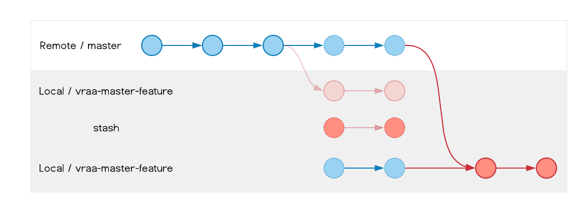

# Git Stash

En este capítulo, conoceremos y emplearemos el Stash, una funcion para rastrear cambios sin alterar los registros del repositorio, es decir, sin la necesidad de un commit.

**Stash**: El Stash en Git es una funcionalidad que guarda temporalmente cambios no confirmados en el área de trabajo para permitir trabajar en otra cosa sin perder el progreso actual.

Podemos considerar al Stash como una bóveda en la que guardamos los cambios realizados desde el último commit, o en el que se encuentre el `HEAD`, para no perderlos en caso de que se requiera trabajar en otra ubicación del repositorio, o en otro commit, esto sin la necesidad de hacer una confirmación de esos cambios. De manera que podamos recuperar ese trabajo no confirmado para continuar el trabajo donde hbía quedado.

Es importante no abusar del Stash ya que, aunque se puede etiquetar la informacion almacenada allí, es muy fácil olvidar que cambios le corresponden a cada ubicación sobre la que se está trabajando. Lo más recomendable es apoyarse en el uso de las ramas y, en caso de requerir el uso del Stash, recuperar esos cambios almacenados lo antes posible y continuar con el trabajo donde se dejó, en lugar de mantenerlo pendiente.

