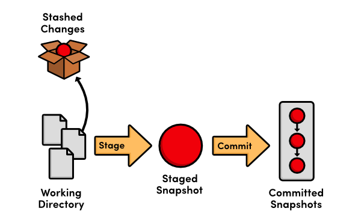

# Git Stash

En este capítulo, conoceremos y emplearemos el Stash, una funcion para rastrear cambios sin alterar los registros del repositorio, es decir, sin la necesidad de un commit.

**Stash**: El Stash en Git es una funcionalidad que guarda temporalmente cambios no confirmados en el área de trabajo para permitir trabajar en otra cosa sin perder el progreso actual.

Podemos considerar al Stash como una bóveda en la que guardamos los cambios realizados desde el último commit, o en el que se encuentre el `HEAD`, para no perderlos en caso de que se requiera trabajar en otra ubicación del repositorio, o en otro commit, esto sin la necesidad de hacer una confirmación de esos cambios. De manera que podamos recuperar ese trabajo no confirmado para continuar el trabajo donde hbía quedado.



Es importante no abusar del Stash ya que, aunque se puede etiquetar la informacion almacenada allí, es muy fácil olvidar que cambios le corresponden a cada ubicación sobre la que se está trabajando. Lo más recomendable es apoyarse en el uso de las ramas y, en caso de requerir el uso del Stash, recuperar esos cambios almacenados lo antes posible y continuar con el trabajo donde se dejó, en lugar de mantenerlo pendiente.


::: {.infobox}
Imagina que **Tony Stark** está mejorando su armadura en su taller, pero de repente recibe una alerta de **SHIELD** porque **Thanos** está atacando. No puede seguir trabajando en su traje en ese momento, pero tampoco quiere *perder sus avances*, así que *guarda* todas sus modificaciones en un compartimento seguro de su laboratorio para _retomarlas más tarde_.

En Git, el `stash` funciona igual: si estás trabajando en cambios pero necesitas cambiar de rama o atender otra tarea sin perder tu progreso, puedes _"guardarlos"_ temporalmente con `git stash` y recuperarlos después con `git stash pop` o `git stash apply`.
:::

## El Stash

Supongamos que Iron Man, Thor, Hulk y Black Widow terminan sus misiones de alta prioridad, por lo que estas se remueven de sus respectivos registros:

* Iron Man

```{bash eval=F}
# Misiones de Iron Man

1. **Desarrollar el Mark XLVII**

   - Descripción: Implementar mejoras en el sistema de vuelo y armas del nuevo traje.
   - Prioridad: Media
   - Fecha límite: 2025-02-15
```

* Thor

```{bash eval=F}
# Misiones de Thor

1. **Negociar una alianza con los Elfos Oscuros**
   - Descripción: Organizar un tratado de paz para evitar conflictos en los Nueve Reinos.
   - Prioridad: Media
   - Fecha límite: 2025-03-01
```

* Hulk

```{bash eval=F}
# Misiones de Hulk

1. **Probar nuevos métodos de control**

   - Descripción: Colaborar con Bruce Banner para mejorar la técnica de meditación bajo estrés.
   - Prioridad: Media
   - Fecha límite: 2025-02-05
```

* Black Widow

```{bash eval=F}
# Misiones de Black Widow

1. **Entrenar a nuevos reclutas de SHIELD**

   - Descripción: Liderar sesiones avanzadas de combate y estrategias de infiltración.
   - Prioridad: Media
   - Fecha límite: 2025-02-15
```


```{bash eval=F}
git commit -am "cumplimiento misiones alta prioridad: Iron Man, Thor, Hulk, Black Widow"
```


```{bash eval=F}
[main e4c626a] cumplimiento misiones alta prioridad: Iron Man, Thor, Hulk, Black Widow
 4 files changed, 4 insertions(+), 49 deletions(-)
```

Se consideran nuevas misiones para asignar a estos héroes, estas deben agregarse a sus registros:

* Iron Man

```{bash eval=F}
# Misiones de Iron Man

1. **Desarrollar el Mark XLVII**

   - Descripción: Implementar mejoras en el sistema de vuelo y armas del nuevo traje.
   - Prioridad: Media
   - Fecha límite: 2025-02-15

2. **Desactivar un satélite fuera de control**

   - Descripción: Un satélite experimental de Stark Industries ha sido hackeado y está a punto de impactar contra una ciudad. Debe ser desactivado antes de que cause una catástrofe.
   - Prioridad: Alta
   - Fecha límite: 2025-03-15

3. **Recuperar una armadura robada**

   - Descripción: Un prototipo del traje Mark L ha sido robado y modificado con tecnología avanzada. Se debe recuperar antes de que caiga en las manos equivocadas.
   - Prioridad: Alta
   - Fecha límite: 2025-02-28
```

* Thor

```{bash eval=F}
# Misiones de Thor

1. **Negociar una alianza con los Elfos Oscuros**
   - Descripción: Organizar un tratado de paz para evitar conflictos en los Nueve Reinos.
   - Prioridad: Media
   - Fecha límite: 2025-03-01

2. **Defender el Bifrost de un ataque enemigo**

   - Descripción: Un ejército de Jotuns ha intentado invadir Asgard usando el Bifrost. Es necesario repeler la invasión y sellar el portal.
   - Prioridad: Alta
   - Fecha límite: 2025-02-20

3. **Capturar a Loki antes de su próximo golpe**

   - Descripción: Loki ha escapado de Asgard y planea sembrar el caos en la Tierra. Se debe localizar y capturarlo antes de que su plan se complete.
   - Prioridad: Alta
   - Fecha límite: 2025-03-05
```

* Hulk

```{bash eval=F}
# Misiones de Hulk

1. **Probar nuevos métodos de control**

   - Descripción: Colaborar con Bruce Banner para mejorar la técnica de meditación bajo estrés.
   - Prioridad: Media
   - Fecha límite: 2025-02-05

2. **Detener a un Hulk Rojo descontrolado**

   - Descripción: Un experimento fallido ha causado que un nuevo Hulk Rojo entre en frenesí. Se debe detener antes de que destruya una ciudad entera.
   - Prioridad: Alta
   - Fecha límite: 2025-02-25

3. **Evitar la activación de un ejército de Hulks sintéticos**

   - Descripción: Un grupo de científicos ha clonado células Gamma para crear supersoldados. Se debe destruir la instalación y detener el proyecto.
   - Prioridad: Alta
   - Fecha límite: 2025-03-08
```

* Black Widow

```{bash eval=F}
# Misiones de Black Widow

1. **Entrenar a nuevos reclutas de SHIELD**

   - Descripción: Liderar sesiones avanzadas de combate y estrategias de infiltración.
   - Prioridad: Media
   - Fecha límite: 2025-02-15

2. **Interceptar un cargamento de armas biológicas**

   - Descripción: Un grupo terrorista ha conseguido armas biológicas de última generación. Se debe interceptar el cargamento antes de que sea distribuido.
   - Prioridad: Alta
   - Fecha límite: 2025-02-22

3. **Eliminar una célula de la Mano en Nueva York**

   - Descripción: Se ha detectado actividad de la organización secreta La Mano en Nueva York. Se debe infiltrar su base y desmantelar sus operaciones.
   - Prioridad: Alta
   - Fecha límite: 2025-03-10
```

Pero antes de completar la asignación de las nuevas misiones llega el Capitán América para registrarse:

1. Primero guardamos las asignaciones en el `stash` para no perder esa información.

```{bash eval=F}
git stash
```

```{bash eval=F}
Directorio de trabajo y estado de índice WIP on main: e4c626a cumplimiento misiones alta prioridad: Iron Man, Thor, Hulk, Black Widow guardados
```

Puedes notar que al ver el estado del repositorio, git no muestra cambios en los archivos.

```{bash eval=F}
git s
```

```{bash eval=F}
## main
```

2. Hacemos el registro del Capitán América.

* `descripciones.md`

```{bash eval=F}
## Capitán América

- **Nombre real:** Steve Rogers
- **Descripción:** Un supersoldado con habilidades físicas mejoradas, líder nato y defensor de la justicia.

```

* `origenes.md`

```{bash eval=F}
## Capitán América

- Fue seleccionado para el Proyecto Súper Soldado durante la Segunda Guerra Mundial y recibió el Suero del Supersoldado.
- Tras liderar varias misiones contra HYDRA, quedó congelado en el hielo por décadas hasta ser encontrado por SHIELD.

```

* `debilidades.md`

```{bash eval=F}
## Capitán América

- A pesar de su fuerza mejorada, sigue siendo humano y vulnerable a heridas graves.
- Su código moral a veces interfiere con decisiones estratégicas difíciles.

```

* `misiones/capitan_america.md`

```{bash eval=F}
# Misiones de Capitán América

1. **Supervisar el entrenamiento de nuevos Vengadores**
   - Descripción: Dirigir ejercicios tácticos y sesiones de combate para nuevos reclutas.
   - Prioridad: Media
   - Fecha límite: 2025-02-10

2. **Recuperar el Escudo original**
   - Descripción: Investigar la ubicación del escudo original, extraviado tras la batalla contra Thanos.
   - Prioridad: Alta
   - Fecha límite: 2025-01-28

3. **Desmantelar células de HYDRA en Sudamérica**
   - Descripción: Operación encubierta para identificar y neutralizar bases secretas de HYDRA.
   - Prioridad: Alta
   - Fecha límite: 2025-02-15

```

* `README.md`

```{bash eval=F}
- [capitan america](/misiones/capitan_america.md)
```

3. guardamos el registro del Capitán América

```{bash eval=F}
git commit -m "se une Capitan America"
```

```{bash eval=F}
[main 5319e68] se une Capitan America
 5 files changed, 34 insertions(+)
 create mode 100644 misiones/capitan_america.md
```

4. para poder continuar con la asignación de nuevas misiones, tenemos que recuperarlas del `stash`. Para ello, antes que otra cosa, debemos listar todo lo que se haya guardado en el `stash`.

```{bash eval=F}
git stash list
```

```{bash eval=F}
stash@{0}: WIP on main: e4c626a cumplimiento misiones alta prioridad: Iron Man, Thor, Hulk, Black Widow
```
Este mensaje contiene bastante información: 

* `stash@{0}` indica el lugar, en jerarquía, del trabajo, en este caso es `0`.

* `WIP` Work In Progres.

* `on main` indica la rama en la que se encuentra el trabajo `main`.

* `e4c626a cumplimiento misiones alta prioridad: Iron Man, Thor, Hulk, Black Widow` indica el registro sobre el que se estaba trabajando.

Para recuperar nuestro trabajo pendiente, la asignación de nuevas misiones, empleamos el siguiente comando.

```{bash eval=F}
git stash pop stash@\{0\}
```

```{bash eval=F}
En la rama main
Cambios no rastreados para el commit:
  (usa "git add <archivo>..." para actualizar lo que será confirmado)
  (usa "git restore <archivo>..." para descartar los cambios en el directorio de trabajo)
	modificados:     misiones/black_widow.md
	modificados:     misiones/hulk.md
	modificados:     misiones/iron_man.md
	modificados:     misiones/thor.md

sin cambios agregados al commit (usa "git add" y/o "git commit -a")
Descartado stash@{0} (f24e0582315c5541a0d8fddc35862e34e1242e15)
```

Con `stash@\{0\}` indicamos cual es el trabajo que queremos recuperar, en este caso era el `0`; para este particular caso, también podemos emplear `git stash pop` ya que por defecto devuelve el trabajo en la posicion `0` y el resto los sube un lugar.

Comprovamos el estado del repositorio.

```{bash eval=F}
git s
```

```{bash eval=F}
## main
 M misiones/black_widow.md
 M misiones/hulk.md
 M misiones/iron_man.md
 M misiones/thor.md
```

Tenemos el trabajo pendiente de vuelta, por lo que podemos seguir trabajando en la asignación de misiones nuevas.


## Conflictos en el Stash

1. Antes de confirmar la asignación de las nuevas misiones, Visión llega para registrarse por lo que, de nuevo, guardamos el progreso en el `stash`.

```{bash eval=F}
git stash
```

```{bash eval=F}
Directorio de trabajo y estado de índice WIP on main: 5319e68 se une Capitan America guardados
```

2. Hacemos el registro de Visión.

* `descripciones.md`

```{bash eval=F}
## Visión

- **Nombre real:** Visión
- **Descripción:** Sintético avanzado creado con la Gema de la Mente y el cuerpo diseñado por Ultron. Posee inteligencia artificial altamente evolucionada y habilidades de manipulación de densidad.

```

* `origenes.md`

```{bash eval=F}
## Visión

- Fue creado por Ultron con el propósito de ser su cuerpo definitivo, pero obtuvo libre albedrío gracias a la intervención de Tony Stark, Bruce Banner y Thor.
- La Gema de la Mente le otorga habilidades extraordinarias, incluyendo vuelo, manipulación de densidad y un intelecto superior.

```

* `debilidades.md`

```{bash eval=F}
## Visión

- Su conexión con la Gema de la Mente lo hace vulnerable si esta es removida o dañada.
- Puede ser afectado por ataques de manipulación de sistemas o tecnología avanzada.

```

* `misiones/vision.md`

```{bash eval=F}
# Misiones de Visión

1. **Analizar anomalías en la Gema de la Mente**  
   - **Descripción:** Examinar irregularidades en la Gema de la Mente para prevenir inestabilidades.  
   - **Prioridad:** Alta  
   - **Fecha límite:** 2025-02-05  

2. **Actualizar protocolos de defensa en la Torre de los Vengadores**  
   - **Descripción:** Optimizar los sistemas de seguridad y detección de amenazas.  
   - **Prioridad:** Media  
   - **Fecha límite:** 2025-02-15  

3. **Proteger a Wanda Maximoff de amenazas externas**  
   - **Descripción:** Vigilar e intervenir en caso de ataques dirigidos contra Scarlet Witch.  
   - **Prioridad:** Alta  
   - **Fecha límite:** 2025-01-30  
```

* `README.md`

```{bash eval=F}
- [vision](/misiones/vision.md)
```

3. guardamos el registro de Visión

```{bash eval=F}
git commit -m "se une Vision"
```

```{bash eval=F}
[main 8531ef2] se une Vision
 5 files changed, 34 insertions(+)
 create mode 100644 misiones/vision.md
```

4. Mientras se registraba a Visión, llegó una misión de extrema urgencia, la cual tomó Iron Man, por lo que se agrega a su registro de misiones como una nueva asignación.

* `misiones/iron_man.md`

```{bash eval=F}
# Misiones de Iron Man

1. **Desarrollar el Mark XLVII**

   - Descripción: Implementar mejoras en el sistema de vuelo y armas del nuevo traje.
   - Prioridad: Media
   - Fecha límite: 2025-02-15

2. **Proteger a un testigo clave en un juicio internacional**

   - Descripción: Vigilar y garantizar la seguridad de un testigo protegido que posee información vital sobre una red de espionaje criminal.
   - Prioridad: Alta
   - Fecha límite: 2025-02-12
```

5. Se registra la nueva asignación.

```{bash eval=F}
git commit -am "asignacion de emergencia para Iron Man"
```

```{bash eval=F}
[main b307d16] asignacion de emergencia para Iron Man
 1 file changed, 6 insertions(+)
```

6. Se retoma la asignación de nuevas misiones.

```{bash eval=F}
git stash pop 
```

```{bash eval=F}
Auto-fusionando misiones/iron_man.md
CONFLICTO (contenido): Conflicto de fusión en misiones/iron_man.md
En la rama main
Cambios a ser confirmados:
  (usa "git restore --staged <archivo>..." para sacar del área de stage)
	modificados:     misiones/black_widow.md
	modificados:     misiones/hulk.md
	modificados:     misiones/thor.md

Rutas no fusionadas:
  (usa "git restore --staged <archivo>..." para sacar del área de stage)
  (usa "git add <archivo>..." para marcar una resolución)
	modificados por ambos:  misiones/iron_man.md

La entrada de stash se guardó en caso de ser necesario nuevamente.
```

7. Nos hemos encontrado con un conflicto en las misiones de Iron Man.

8. Comprobamos el estado del repositorio.

```{bash eval=F}
git s
```

```{bash eval=F}
## main
M  misiones/black_widow.md
M  misiones/hulk.md
UU misiones/iron_man.md
M  misiones/thor.md
```

Git reconoce las modificaciones en las misiones de Thor, Hulk y Black Widow; el marcador `UU` indica que se realizaron cambios desde ambos lados del `stash`

9. Resolvemos los conflictos encontrados.

* `misiones/iron_man.md`

```{bash eval=F}
# Misiones de Iron Man

1. **Desarrollar el Mark XLVII**
   
   - Descripción: Implementar mejoras en el sistema de vuelo y armas del nuevo traje.
   - Prioridad: Media
   - Fecha límite: 2025-02-15

<<<<<<< Updated upstream
2. **Proteger a un testigo clave en un juicio internacional**

   - Descripción: Vigilar y garantizar la seguridad de un testigo protegido que posee información vital sobre una red de espionaje criminal.
   - Prioridad: Alta
   - Fecha límite: 2025-03-12
=======
2. **Desactivar un satélite fuera de control**
   
   - Descripción: Un satélite experimental de Stark Industries ha sido hackeado y está a punto de impactar contra una ciudad. Debe ser desactivado antes de que cause una catástrofe.
   - Prioridad: Alta
   - Fecha límite: 2025-03-15

3. **Recuperar una armadura robada**
   
   - Descripción: Un prototipo del traje Mark L ha sido robado y modificado con tecnología avanzada. Se debe recuperar antes de que caiga en las manos equivocadas.
   - Prioridad: Alta
   - Fecha límite: 2025-02-28
>>>>>>> Stashed changes
```

Similarmente a los conflictos al mezclar ramas:

* La marca `<<<<<<< Updated upstream` indica el trabajo registrado desde el commit del que se guardó el trabajo en el `stash`.

* La marca `=======` separa los trabajos del registro y del `stash`.

* La marca `>>>>>>> Stashed changes` indica el trabajo almacenado en el `stash`.

En resumen lo que se encuentra entre `<<<<<<< Updated upstream` y `=======` es el trabajo registrado desde el commit en el que se almacenó el trabajo al `stash`; entre `=======` y `>>>>>>> tierra-65` se encuentra el trabajo almacenado en el `stash`.

10. En este caso se mantendrán todas las misiones, solo se cambiará el número de misión.

* `misiones/iron_man.md`

```{bash eval=F}
# Misiones de Iron Man

1. **Desarrollar el Mark XLVII**
   
   - Descripción: Implementar mejoras en el sistema de vuelo y armas del nuevo traje.
   - Prioridad: Media
   - Fecha límite: 2025-02-15

2. **Proteger a un testigo clave en un juicio internacional**

   - Descripción: Vigilar y garantizar la seguridad de un testigo protegido que posee información vital sobre una red de espionaje criminal.
   - Prioridad: Alta
   - Fecha límite: 2025-03-12

3. **Desactivar un satélite fuera de control**
   
   - Descripción: Un satélite experimental de Stark Industries ha sido hackeado y está a punto de impactar contra una ciudad. Debe ser desactivado antes de que cause una catástrofe.
   - Prioridad: Alta
   - Fecha límite: 2025-03-15

4. **Recuperar una armadura robada**
   
   - Descripción: Un prototipo del traje Mark L ha sido robado y modificado con tecnología avanzada. Se debe recuperar antes de que caiga en las manos equivocadas.
   - Prioridad: Alta
   - Fecha límite: 2025-02-28
```

11. Registramos la asignación de nuevas misiones.

```{bash eval=F}
git commit -am "nuevas misiones asignadas: Iron Man, Thor, Hulk, Black Widow"
```

```{bash eval=F}
[main 1db9966] nuevas misiones asignadas: Iron Man, Thor, Hulk, Black Widow
 4 files changed, 51 insertions(+), 2 deletions(-)
```